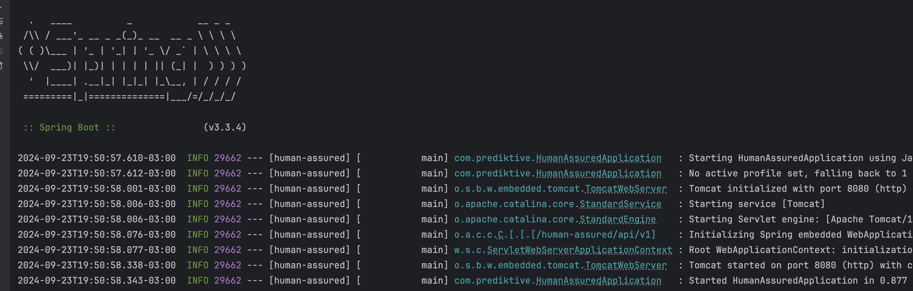

## Human Assured Application

This a project aims make sure of any application is accessed by humans and not a by any computers or bot.

The used approach is message exchange interaction for a question and an answer. The service provide a question to be solved and the user must answer with the correct response.

There is no need to login and application is totally Stateless.

### Assumptions

In order to achieve the main assumptions to be considered in terms of use cases are:

* The application is public and does not require any authentication (login, for example)
* The user ask for service provide a new question
* The user must answer the sent question in a time window of 60 seconds. This is for bot prevetion, fraud detection, securitym, user engagement and efficient resource usage.
* The question that should be answered must be the previous one sent for that specific user (session and device)
* If the time to expire to answer the question correctly (following the format) the user must be ask to service provide a new one question

### How to Run

Follow the used libraries and how to run the application.

#### Technologies and Libraries

* Java 8+ (17)
* HTTP
* REST
* Swagger
* Postman
* Spring Boot
* JUnit (Unit tests)
* RestAssured (Integration/API tests)

The application was built in Spring Boot, and the basic command to run is:

```
mvn spring-boot:run
```

This will run application on the port ``8080``.


The terminal output should be something like this:




### Application Design

The application run on the web service by the REST API.

#### 1. Overview

Considering the use case workflow the service has 4 steps in overrall, following the cronologial order of user interaction, as enumarated in the image.


Basicly the application has 2 endpoints for workflow:

* ``GET /message/ask``
* ``POST /message/answer``

The swagger documentation is available in running application by http://localhost:8080/human-assured/api/v1/swagger-ui/index.html


#### 1.1. User request a new question

The first thing to dispatch the follow in ask for a new question access the endpoint 
> GET /message/ask

#### 1.2. Service respond with a new question

Whenever the user ask for a new question it's require to call this endpoint. The service responds with the header ``X-Api-Token`` in order to identify the user interaction (question associated with the user). In the next topic will be cover the details about the token strucuture.

The service responds to user with a question containg 2 or 3 randomized numbers, like this:

`````
Here you go, solve the question: “Please sum the numbers 9,5,3”.
`````

#### 1.3. The user responds the question

After the user receive the question provided by the service in the previous ones steps, the asnwer must be provided to the service by calling the following endpoint:

> POST /message/answer

The user must provide the token in the header request ``X-Api-Token`` in order to service identify that this asnwer is associated with the previous question. The response should follow a specific format like this:

`````
Great. The original question was “Please sum the numbers 9,5,3” and the answer is 17.
`````

#### 1.4. Service responds to user 

The service process the user response following:

* Validate the token (expiration, user identity)
* Check the correctness of the response

The service response to the user if it is correct or not.

### Token Structure

The token is a JWT token that uses HS256 algorithm to encrypt the data. It is structured by the 3 following item that identify the user for that specific interaction:

| Token item                                                                        | Example  |
|-----------------------------------------------------------------------------------|:-------------:|
| [Session Id](https://developer.mozilla.org/en-US/docs/Web/HTTP/Session)           | 84266fdbd31d4c2c6d0665f7e8380fa3     |
| [User Agent](https://developer.mozilla.org/en-US/docs/Web/HTTP/Headers/User-Agent) | Mozilla/5.0 (Linux; Linux x86_64) Gecko/20100101 Firefox/53.3     |
| [IP](https://developer.mozilla.org/en-US/docs/Web/HTTP/Overview)                                                                            | 27.79.137.171     |
| Sum of the numbers                                                                | 17     |

The main reason to choose these item to compose the token is that the combination of the these info must identify:

* The specific session (user)
* The specific request (question)
* Done by the specific device
* From a specific Internet Protocol (IP)

#### Trade-offs 

Once each one of token item could be a good candidate to identify the user interaction according to definition by each one (linked on the table), there is a some risks that so that the original meaning could be violated.

* The service can be violated by a **[Session Hijacking](https://pt.wikipedia.org/wiki/Session_hijacking)** attack, using XSS, Malware or other mechanism.
* The ``User-Agent``could be changed by the client side just passing a different one on the header
* The request could be redirected from a different **IP** from a Load Balancer or Api Gateway.

These mechanisms are different strategies to violate the user identity that any web application could be vulnerable. However there some approach to prevent them:

* The combination of these 4 info in a unique token is one more level of security instead of usage it individually (CorrelationID).
* A token expiration of 60 seconds is more one level to prevent bots and better usage of resources.
* Usage of HTTPS instead of HTTP. The SSL certificate is a good mechanism to traffic encrypted data between client and server.

### Tests Suite

The following tests were implemented:

* Unit Tests
* Integration tests (API)


### Improvements and Future Contributions

The target of this project is present a proposed solution considering the limited time but keeping in mind the possible improvements.

* Considering the application grow we have to think about of Scalability. A good option would be to provide a Kubernetes cluster deployed in some cloud provider like Amazon AWS by the AWS EKS service.
* It could use a Terraform for IaC and avoid a lock-in cloud vendor. 
* For a big scaling would be a good practice to adopt an APM to implement telemetry and increase the level of observability. Tools like New Relic and Datadog would be a good options.
* For CI/CD process we could create an automation steps to build, tests, vulnerabilities or even deployment. Canary Deployment is a good practice in high concurrent environments.
* In terms of tests implementation it would be good implement mutation tests (pitest) and load tests (k6, JMeter) in order to increase tests quality.